# wakatimeReadmeStats
<div align="center">
  
  
  
</div>

## What is wakatimeReadmeStats?

`wakatimeReadmeStats` lets you showcase pretty, customizable coding activity cards in your GitHub README.  
It pulls your latest WakaTime data and renders it as rich SVG charts you can embed directly using GitHub Actions.

## Table of Contents

- [Quick Setup](#quick-setup)
- [Formatting Examples](#formatting-examples)
- [Troubleshooting](#troubleshooting)
- [Themes](#themes)
- [Component Types](#component-types)
- [Chart Types](#chart-types)
- [All Shared Parameters](#all-shared-parameters)
- [All Component-Specific Parameters](#all-component-specific-parameters)

## Quick Setup
<a href="https://youtu.be/JtDCl90kVt8" target="_blank" rel="noopener noreferrer">
  
</a>

1. **Create a WakaTime account**
   - Sign up: https://wakatime.com/signup
   - Set your profile to **public** and note your **username**
   - Connect WakaTime to your IDE

2. **Add your WakaTime API key (required)**
   - Copy your API key: https://wakatime.com/settings/account
   - In your GitHub repo:
     - **Settings → Secrets and variables → Actions → New repository secret**
     - **Name:** `WAKATIME_API_KEY`
     - **Value:** *(your API key)*

3. **Set up a GitHub token (recommended)**

   **Option A — Built-in token (recommended, no setup required)**  
   GitHub Actions automatically provides `secrets.GITHUB_TOKEN`.  
   Ensure your workflow includes:
   ```yml
   permissions:
     contents: write

<details>
<summary>Copy/Paste-Ready Example</summary>
<br/>
  
**Note:** if your WakaTime and GitHub usernames are different, replace ```"$GITHUB_ACTOR"``` in the URL with your actual WakaTime username.

```yml
name: Update WakaTime Stats SVG

on:
  schedule:
    - cron: "0 */6 * * *" # every 6 hours
  workflow_dispatch:

permissions:
  contents: write

jobs:
  generate-stats:
    runs-on: ubuntu-latest

    steps:
      - name: Checkout repo
        uses: actions/checkout@v4

      - name: Generate all SVGs from Vercel API
        env:
          WAKATIME_API_KEY: ${{ secrets.WAKATIME_API_KEY }}
          GITHUB_TOKEN: ${{ secrets.GITHUB_TOKEN }}
        run: |
          set -euo pipefail
          mkdir -p wakatime

          BASE="https://wakatime-readme-stats.vercel.app/api/wakatimeStats?username=$GITHUB_ACTOR&api_key=$WAKATIME_API_KEY&github_token=$GITHUB_TOKEN&theme=dark_github&components=1"

          for type in rank basic heatmap weekly weekly_avg weekly_langs weekly_projs all_langs all_projs spedometer ai_coding ai_agent personal_info; do
            echo "Generating wakatime/${type}.svg"
            curl -fsSL "${BASE}&component1_type=${type}" -o "wakatime/${type}.svg"
          done

      - name: Bump README cache-busters (daily)
        run: |
          set -euo pipefail

          V="$(date -u +%Y%m%d)"  # changes once per day

          sed -i -E "s#(wakatime/[a-z_]+\.svg)\?v=[0-9]+#\1?v=$V#g" README.md
          sed -i -E "s#(wakatime/[a-z_]+\.svg)(\"|')#\1?v=$V\2#g" README.md

      - name: Commit changes to repo
        run: |
          set -euo pipefail
          git config user.name "github-actions[bot]"
          git config user.email "github-actions[bot]@users.noreply.github.com"

          git add wakatime/ README.md
          git diff --cached --quiet && echo "No changes" && exit 0

          git commit -m "Update WakaTime stats SVGs (cache-bust v=$(date -u +%Y%m%d))"
          git push
```
</details>

4. **Add the Stats Card to your README**
<<<<<<< HEAD
   - Add this to your readme: ```md ``` (or use any other type like `basic.svg`, `heatmap.svg`, etc.)
=======
   - Add this to your readme: ```md ```
>>>>>>> 832ff57469df1a0f23dfddf2820d1b2c1d55792d
   - To update immediately, navigate to actions -> Update WakaTime Stats SVG (or other name used) -> Run Workflow and click **Run Now**.
   - If you’re using a profile README (<username>/<username> repo), put the workflow in that repo (the same place as the README being edited).

## Formatting Examples

The card can be customized by changing the curl command in your GitHub actions workflow, such as in the examples below.

### Basic URL
```
https://wakatime-readme-stats.vercel.app/api/wakatimeStats?username=your_wakatime_username&api_key=your_api_key&github_token=your_github_token
```
<div align="center">
  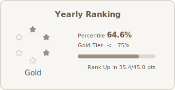
  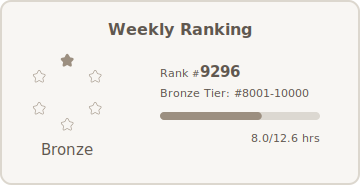<br/>

  <sub>&nbsp;&nbsp;&nbsp;&nbsp;&nbsp;&nbsp;Basic (`&component1_mode=level`)</sub>
  &nbsp;&nbsp;&nbsp;&nbsp;&nbsp;&nbsp;&nbsp;&nbsp;&nbsp;&nbsp;&nbsp;&nbsp;&nbsp;&nbsp;&nbsp;&nbsp;&nbsp;&nbsp;&nbsp;&nbsp;&nbsp;&nbsp;&nbsp;
  <sub>add `&component1_default_source=waka`</sub>
</div>

<br/>

<div align="center">
  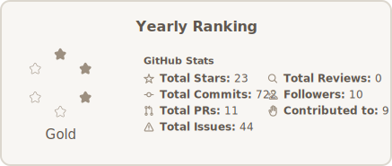
  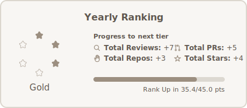<br/>

  <sub>add `&component1_mode=stats`</sub>
  &nbsp;&nbsp;&nbsp;&nbsp;&nbsp;&nbsp;&nbsp;&nbsp;&nbsp;&nbsp;&nbsp;&nbsp;&nbsp;&nbsp;&nbsp;&nbsp;&nbsp;&nbsp;&nbsp;&nbsp;&nbsp;&nbsp;&nbsp;
  <sub>&nbsp;&nbsp;&nbsp;add `&component1_mode=progress`</sub>
</div>

> Heads up: Without `github_token`, all cards force `default_source=waka` and (shared and per-component) and `mode=level` on rank card. With a `github_token`, shared and per-component defaults are `combo` unless you override them. Star Rank treats `combo` as GitHub when a token exists, and as WakaTime when it doesn't.

### Full URL (Multiple Components + Styling + Scaling)

```
https://wakatime-readme-stats.vercel.app/api/wakatimeStats?username=your_wakatime_username&api_key=your_api_key
&components=2
&title_prefix=_____%27s&border_width=2&border_radius=10&scale=true
&bg_color=e6ddd8&title_color=fcf9f2&text_color=997967&logo_color=fcf9f2&border_color=ab8c7b
&component1_scale_value=1.5&component1_type=weekly_avg&component1_chart_type=radar&component1_chart_color=fcf9f2
&component1_start_day=mo&component1_y_axis=true&component1_y_axis_label=true&component1_hide_legend=true&component1_hide_total=true
&component2_type=heatmap&component2_start_day=mo&component2_heatmap_color=fcf9f2
```
*Remember to remove spaces and newlines*

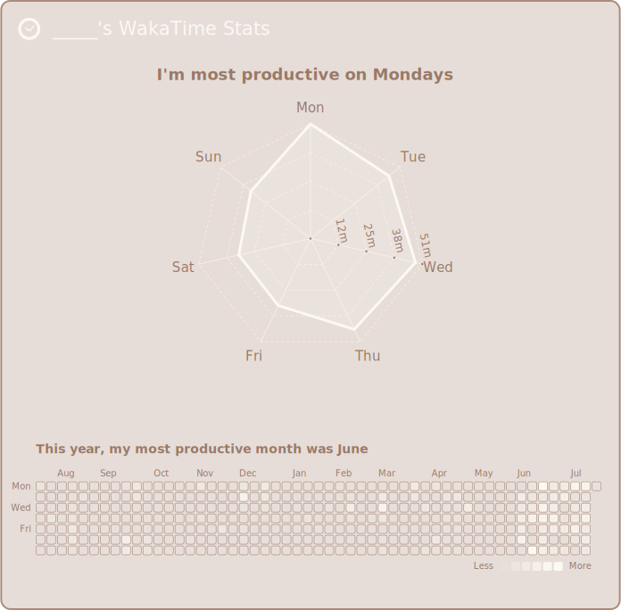

## Troubleshooting

- **No output?** Make sure your WakaTime profile and GitHub repository are **public**
- **URL broken?** Check your `username` and `WAKATIME_API_KEY`
- **Not updating?** Trigger a manual update via GitHub Actions, or append `?v=1` to the image URL on your readme to bypass cache.
- **Still seeing old data?** Add a unique query string to the image URL on your readme, like `?timestamp=<some-value>` to force a fresh load.
- **SVG not committed?** Make sure your `.gitignore` doesn't exclude the `wakatime/` folder or `*.svg` files.

## Optional for Customization

### Themes

<div align="center">
  
  
  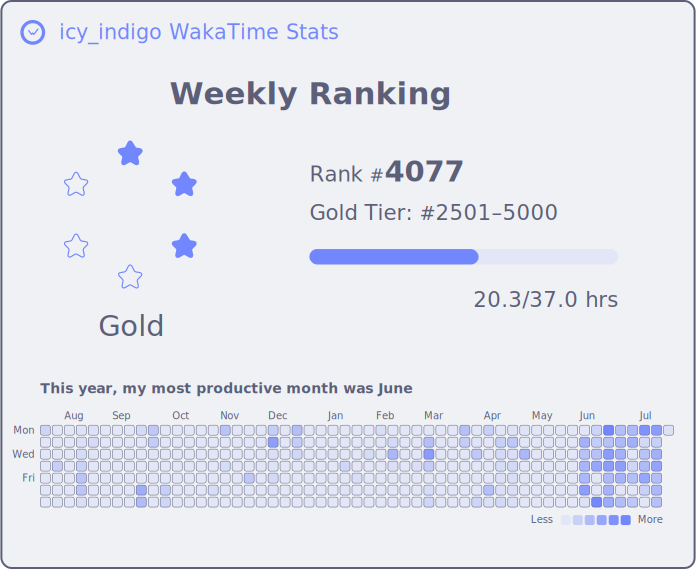
</div>

<div align="center">
  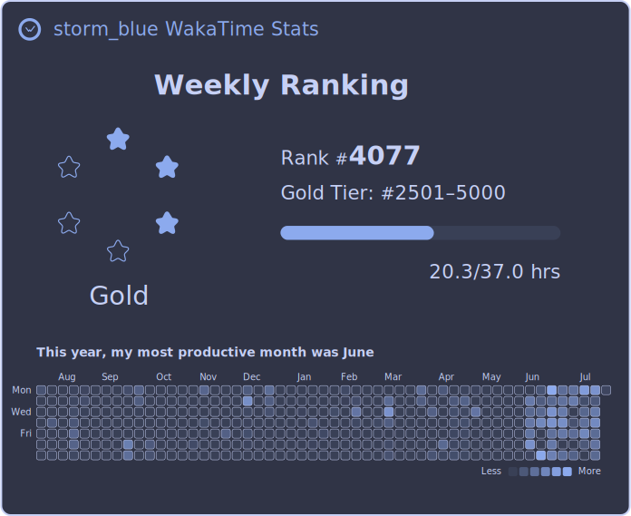
  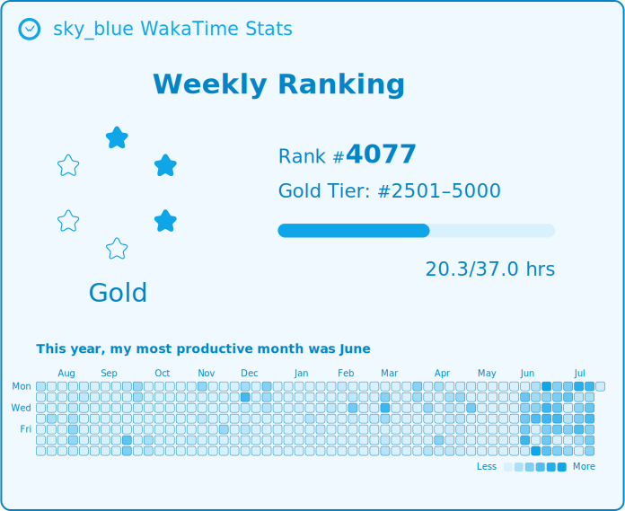
  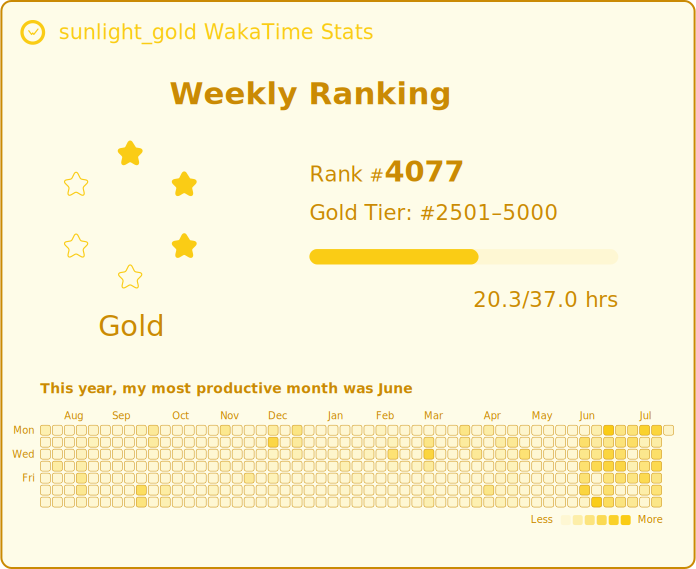
</div>

<div align="center">
  
  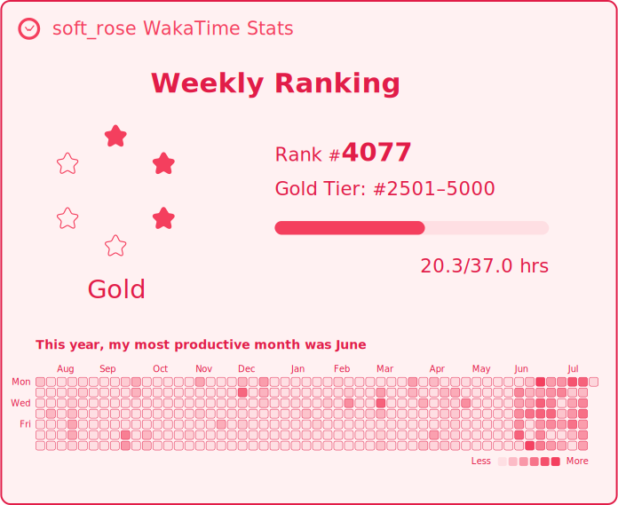
  
</div>

<div align="center">
  
  
  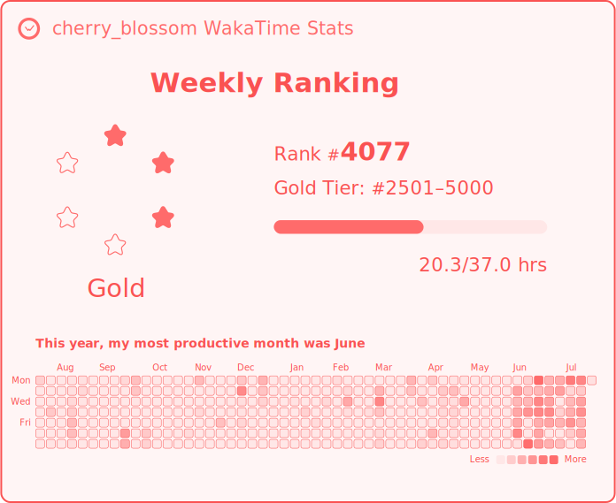
</div>

<div align="center">
  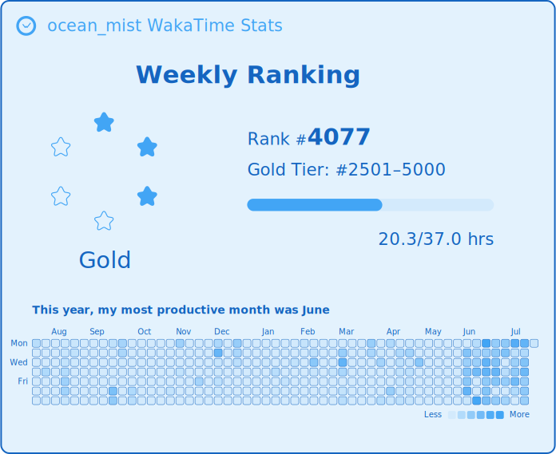
  
  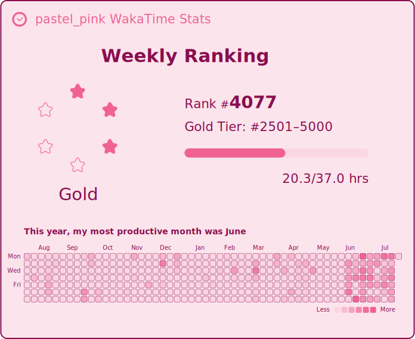
</div>

<div align="center">
  
  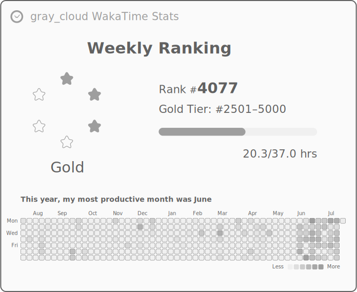
  
</div>

<div align="center">
  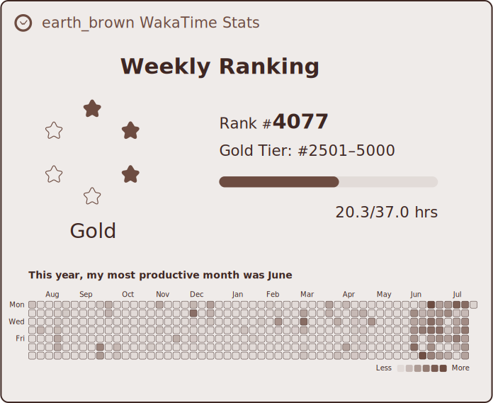
  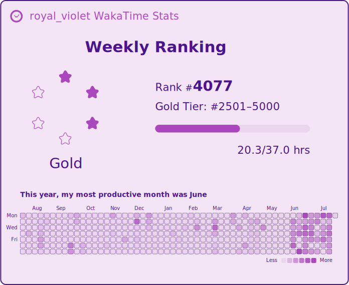
  
</div>

<div align="center">
  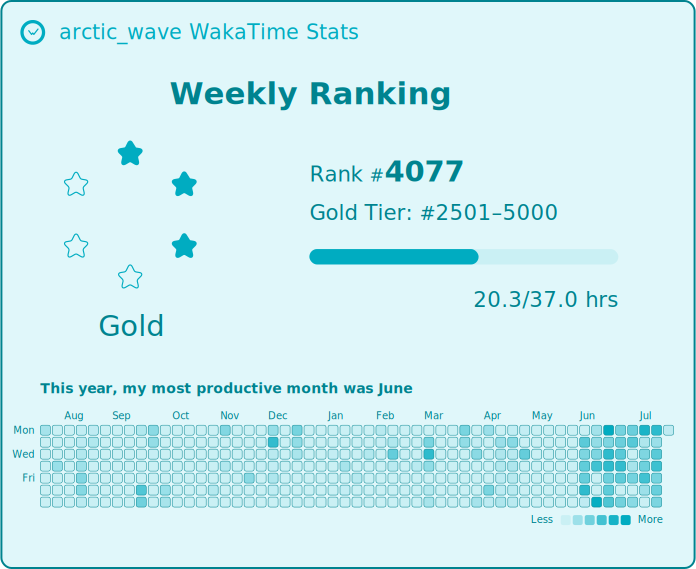
  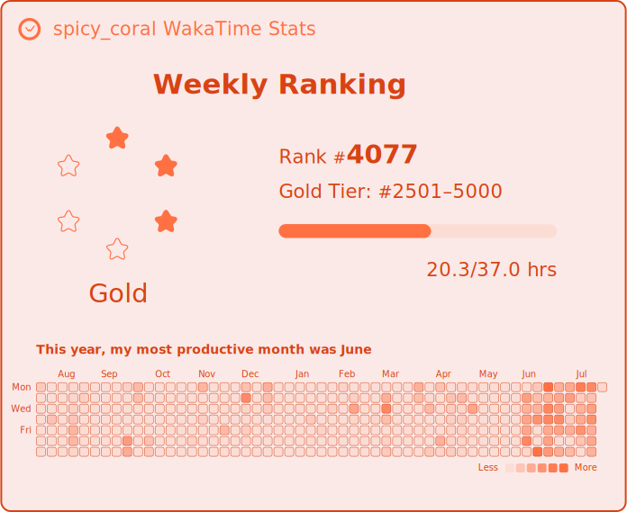
  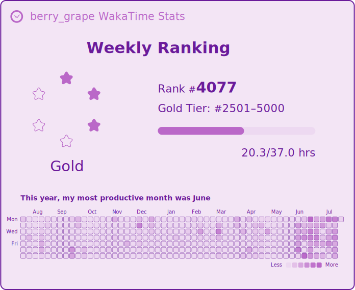
</div>

<div align="center">
  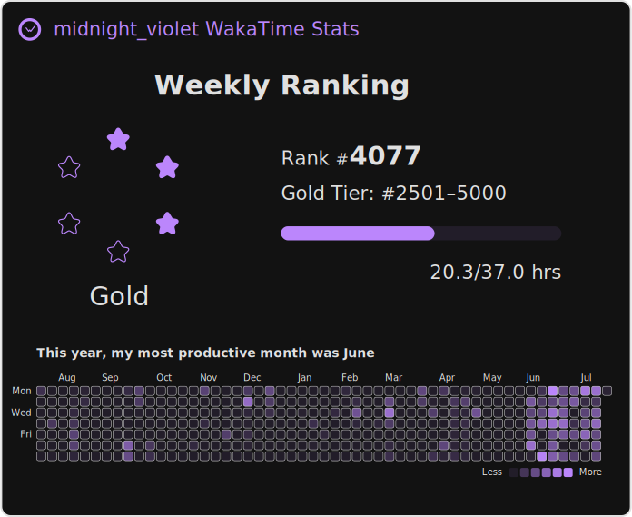
  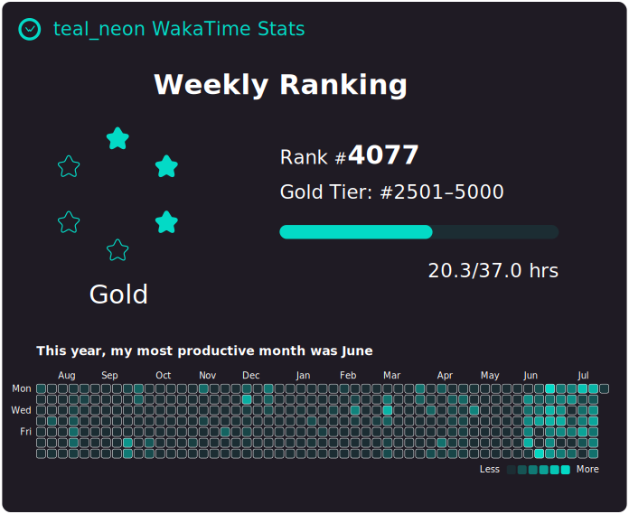
  
</div>

<div align="center">
  
  
  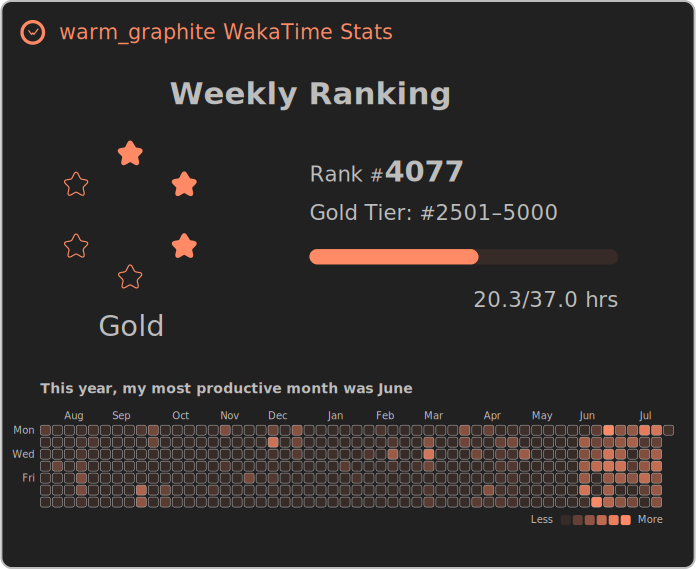
</div>

<div align="center"> 
  <details>
    <summary>Name key for themes</summary>
    <div style="text-align: left; display: inline-block;">
      <div>• mocha_pink (row1, col1)</div>
      <div>• latte_red (row1, col2)</div>
      <div>• icy_indigo (row1, col3)</div>
      <div>• storm_blue (row2, col1)</div>
      <div>• sky_blue (row2, col2)</div>
      <div>• sunlight_gold (row2, col3)</div>
      <div>• fresh_green (row3, col1)</div>
      <div>• soft_rose (row3, col2)</div>
      <div>• neutral_cyan (row3, col3)</div>
      <div>• amber_cream (row4, col1)</div>
      <div>• nature_green (row4, col2)</div>
      <div>• cherry_blossom (row4, col3)</div>
      <div>• ocean_mist (row5, col1)</div>
      <div>• lime_leaf (row5, col2)</div>
      <div>• pastel_pink (row5, col3)</div>
      <div>• lavender_dream (row6, col1)</div>
      <div>• gray_cloud (row6, col2)</div>
      <div>• frost_steel (row6, col3)</div>
      <div>• earth_brown (row7, col1)</div>
      <div>• royal_violet (row7, col2)</div>
      <div>• lemon_glow (row7, col3)</div>
      <div>• arctic_wave (row8, col1)</div>
      <div>• spicy_coral (row8, col2)</div>
      <div>• berry_grape (row8, col3)</div>
      <div>• midnight_violet (row9, col1)</div>
      <div>• teal_neon (row9, col2)</div>
      <div>• dark_github (row9, col3)</div>
      <div>• classic_monokai (row10, col1)</div>
      <div>• cyber_aqua (row10, col2)</div>
      <div>• warm_graphite (row10, col3)</div>
    </div>
  </details>
</div>

### AI Coding Card

<div align="center">
  
</div>

Shows your AI-assisted coding stats with a donut chart (AI vs Human code ratio), AI/human line changes, token usage, cost, review sessions, and follow-up edits.

**Local development URL:**
```
http://localhost:3000/api/wakatimeStats?username=YOUR_USERNAME&api_key=YOUR_API_KEY&components=1&component1_type=ai_coding
```

### Personal Info Card

<div align="center">
  
</div>

Shows your total coding time (prominent), current day, daily average, and most active day.

**Local development URL:**
```
http://localhost:3000/api/wakatimeStats?username=YOUR_USERNAME&api_key=YOUR_API_KEY&components=1&component1_type=personal_info
```

### AI Agent Card

<div align="center">
  
</div>

Breaks down AI coding contributions by agent (Deepseek, GPT, Gemini, etc.) with a donut chart, line counts, percentages, and costs.

**Local development URL:**
```
http://localhost:3000/api/wakatimeStats?username=YOUR_USERNAME&api_key=YOUR_API_KEY&components=1&component1_type=ai_agent
```

### Component Types

<div align="center">
  
  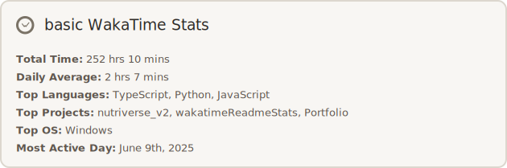
</div>

<div align="center">
  
  
  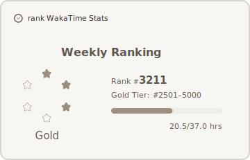
</div>

<div align="center">
  
  
  
</div>

<div align="center">
  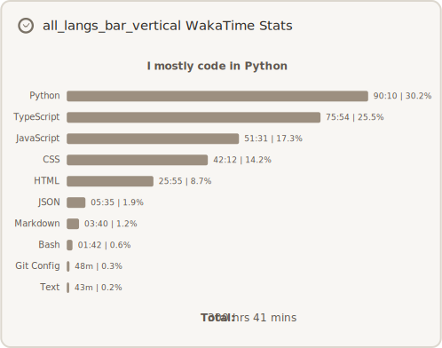
  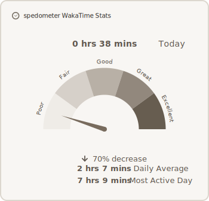
</div>

<div align="center"> 
  <details>
    <summary>Name key for component types</summary>
    <div style="text-align: left; display: inline-block;">
      <div>• heatmap (row1, col1)</div>
      <div>• basic (row1, col2)</div>
      <div>• weekly (row2, col1)</div>
      <div>• weekly_avg (row2, col2)</div>
      <div>• rank (row2, col3)</div>
      <div>• weekly_langs (row3, col1)</div>
      <div>• weekly_projs (row3, col2)</div>
      <div>• all_projs (row3, col3)</div>
      <div>• all_langs (row4, col1)</div>
      <div>• spedometer (row4, col2)</div>
    </div>
  </details>
</div>

### Chart Types

<div align="center">
  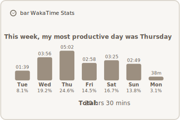
  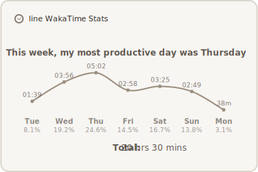
  
</div>

<div align="center">
  
  
  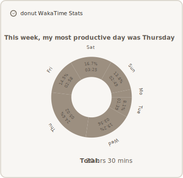
</div>

<div align="center">
  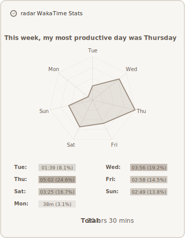
  
</div>

<div align="center"> 
  <details>
    <summary>Name key for chart types</summary>
    <div style="text-align: left; display: inline-block;">
      <div>• bar (row1, col1)</div>
      <div>• line (row1, col2)</div>
      <div>• area (row1, col3)</div>
      <div>• bar_vertical (row2, col1)</div>
      <div>• spiral (row2, col2)</div>
      <div>• donut (row2, col3)</div>
      <div>• radar (row3, col1)</div>
      <div>• bubble (row3, col2)</div>
    </div>
  </details>
</div>

<br/>
<details>
<summary>Click to expand full customization parameter list</summary>
  
### All Shared Parameters

| **Parameter**            | **Components**         | **Value**            | **Description**                                                                 | **Example**                         |
|--------------------------|------------------------|----------------------|---------------------------------------------------------------------------------|-------------------------------------|
| `username`               | All                    | `string`             | **Required**. Your WakaTime username (from your WakaTime profile URL).          | `username=yourname`               |
| `default_source`         | All / per-component    | `waka` / `github` / `combo` (default: `waka` without `github_token`, `combo` with one) | Chooses data source. No token: everything uses `waka`. With a token: default is `combo` (Waka/GitHub blend where supported). Star Rank does not support `combo` and will use GitHub when a token is present, WakaTime otherwise. | `default_source=waka` / `component1_default_source=combo` |
| `theme`                  | All                    | `string`             | Color theme for all card colors.                                                | `theme=teal_neon`                 |
| `bg_color`               | All                    | hex color            | Background color of the SVG card.                                               | `bg_color=ffffff`                 |
| `title_color`            | All                    | hex color            | Color of the title text.                                                        | `title_color=000000`              |
| `text_color`             | All                    | hex color            | Color of all other text.                                                        | `text_color=333333`               |
| `logo_color`             | All                    | hex color            | Color used to fill the WakaTime logo.                                           | `logo_color=a68b2c`               |
| `font_family`            | All                    | string               | Font used across the card.                                                      | `font_family=Fira Code`           |
| `border_color`           | All                    | hex color            | Color of the outer border.                                                      | `border_color=cccccc`             |
| `border_width`           | All                    | number (px)          | Border thickness in pixels.                                                     | `border_width=2`                  |
| `border_radius`          | All                    | number (px)          | Rounded border radius.                                                          | `border_radius=10`                |
| `show_header`            | All                    | `true` / `false`     | Toggle the top header (logo + title). Default is `false` when only 1 component, otherwise `true`. | `show_header=false`               |
| `show_logo`              | All                    | `true` / `false`     | Whether to show the WakaTime logo.                                              | `show_logo=true`                  |
| `title_prefix`           | All                    | string               | Prefix text for the title.                                                      | `title_prefix=My`                 |
| `title_scale_value`      | All                    | decimal              | Scales the title block width (relative to the widest component).                | `title_scale_value=0.8`           |
| `scale`                  | All                    | `true` / `false`     | Whether to auto-scale all components to the same width.                         | `scale=true`                      |
| `componentX_scale_value` | All                    | decimal              | Per-component width scale relative to the widest one. Overrides `scale`.        | `component1_scale_value=1.5`      |

### All Component-Specific Parameters

| **Parameter**            | **Components**                          | **Value**                     | **Description**                                                                 | **Example**                          |
|--------------------------|-----------------------------------------|-------------------------------|---------------------------------------------------------------------------------|--------------------------------------|
| `type`                   | All                 | `basic`, `heatmap`, `rank`, `spedometer`, `weekly`, `weekly_avg`, `weekly_langs`, `weekly_projs`, `all_langs`, `all_projs`      | Specifies which card to render.                                                | `component1_type=weekly_avg`        |
| `chart_type`             | `weekly`, `weekly_avg`, `weekly_langs`, `weekly_projs`, `all_langs`, `all_projs` | `bar`, `bar_vertical`, `line`, `area`, `radar`, `bubble`, `donut`, `spiral` → See notes below for compatibility.  | Chart visualization style.                                          | `component1_chart_type=radar`       |
| `chart_color`            | Same as above                          | hex color                     | Color of bars/lines in charts.                                                 | `component1_chart_color=fcf9f2`      |
| `chart_curved_line`      | Same as above                          | `true` / `false`              | Enables curved line chart if applicable.                                       | `component1_chart_curved_line=true`  |
| `start_day`              | `heatmap`, `weekly`, `weekly_projs`, `weekly_langs` | `mo`, `-7`, etc.              | Starting point for data in charts.                                             | `component1_start_day=-7`           |
| `heading_type`           | `heatmap`, `weekly`, `weekly_avg`, `weekly_langs`, `weekly_projs`, `all_langs`, `all_projs`                    | `friendly`, `compact`         | Title formatting style.                                                        | `component2_heading_type=compact`    |
| `hide_title`             | All                                     | `true` / `false`              | Hides the component title.                                                     | `component3_hide_title=true`        |
| `hide_total`, `hide_time`, `hide_percentage`, `hide_legend` | Most charts                   | `true` / `false`                          | Optionally hide stats within chart.                                | `component2_hide_legend=true`       |
| `y_axis`, `y_axis_label` | Most bar charts                        | `true` / `false`              | Controls Y-axis visibility and label.                                          | `component1_y_axis=true`            |
| `num_langs`, `num_projs` | `all_langs`, `all_projs`               | integer                        | How many top items to show.                                                    | `component2_num_langs=5`            |
| `heatmap_color`          | `heatmap`                              | hex color                     | Color of the heatmap blocks.                                                   | `component3_heatmap_color=fcf9f2`    |
| `rank_color`             | `rank`                                 | hex color                     | Color of the rank highlight.                                                   | `component2_rank_color=ffcc00`       |
| `hide_github_contributions` | `basic` (GitHub/combo)              | `true` / `false`              | Hide GitHub total contributions line.                                         | `component1_hide_github_contributions=true` |
| `hide_github_commits`    | `basic` (GitHub/combo)                 | `true` / `false`              | Hide GitHub commits line.                                                      | `component1_hide_github_commits=true` |
| `hide_github_prs`        | `basic` (GitHub/combo)                 | `true` / `false`              | Hide GitHub pull requests line.                                               | `component1_hide_github_prs=true` |
| `hide_github_issues`     | `basic` (GitHub/combo)                 | `true` / `false`              | Hide GitHub issues line.                                                      | `component1_hide_github_issues=true` |
| `hide_github_reviews`    | `basic` (GitHub/combo)                 | `true` / `false`              | Hide GitHub reviews line.                                                     | `component1_hide_github_reviews=true` |
| `hide_github_stars`      | `basic` (GitHub/combo)                 | `true` / `false`              | Hide GitHub stars line.                                                       | `component1_hide_github_stars=true` |
| `hide_github_followers`  | `basic` (GitHub/combo)                 | `true` / `false`              | Hide GitHub followers line.                                                   | `component1_hide_github_followers=true` |
| `mode`                   | `rank`                                 | `level` (default), `stats`, `progress` | Switch right-hand display: `level` shows tier/progress, `stats` shows GitHub inputs, `progress` shows how many more of each stat are needed for the next tier (GitHub only). If `default_source=waka`, non-`level` modes fall back to `level`. | `component1_mode=stats` |
| `show_icons`             | `rank`                                 | `true` / `false`              | Show colored icons beside rank stats/progress rows.                           | `component1_show_icons=true` |
| `difficulty`             | `spedometer`                           | `self`, `easy`, `medium`, `hard`      | Difficulty range for spedometer gauge.                                         | `component1_difficulty=medium`       |
| `label_type`             | `spedometer`                           | `standard`, `emoji`, `game`, `emojiStandard`, `emojiGame`, `customEmoji`, `customEmojiStandard`, `customEmojiGame`           | How labels are shown above the gauge.                                          | `component1_label_type=emojiGame`        |
| `custom_emojis`          | `spedometer`                           | 5 emojis string                  | Used when label_type includes customEmoji variations.                                 | `component1_custom_emojis=🐢🐇🚀🔥👑`    |
| `show_high_score`        | `spedometer`                           | `true` / `false`              | Whether to show your highest speed value.                                      | `component1_show_high_score=true`    |

🧾 Notes on chart_type compatibility:
- bar: in all chart components
- radar: only in weekly_avg and weekly
- line, area: not in all_langs, all_projs
- bar_vertical: only in all_langs, all_projs
- bubble, donut: not in weekly_langs, weekly_projs
- spiral: only in weekly, weekly_avg
</details>
